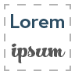

# Lorem Ipsum plugin for Adobe XD
> Add placeholder text. As simple as you want it to be, yet as advanced as you need it to be...

- [Project Homepage](https://xdplugins.pabloklaschka.de/plugins/lorem-ipsum)
- [Open in XD Plugin Manager](https://xd.adobelanding.com/en/xd-plugin-download/?name=700b7996)

Official repository for the Lorem Ipsum plugin for Adobe XD.

## Plugin Description
A small plugin to insert placeholder text that fits your needs: As simple as you want it to be, yet as advanced as you need it to be…

It is as easy as selecting one or more text layer(s) and running the plugin from the plugin's menu. Alternatively, you can also use the keyboard shortcut "Ctrl+Alt+L" on Windows or "Cmd+Option+L" on macOS to run the plugin.

Last but not least: I’m always happy to listen to feedback. Therefore, if you have any (may it be feature requests, bug reports or something else), please let me know via the support website, and I'll see how I can accommodate your wishes.

## Development
### Setup
Once you've cloned the repo, you merely need to run `npm install` in the root folder of the (cloned) project from your console.

### Usage
The main two folders you'll be working in are the `src` folder (where all your JavaScript source code gets into) as well as the `dist` folder, which is where your code gets compiled into and where you'll need to put all the "static" resources (like images, icons etc. – also your manifest.json file is here).

It is the `dist` folder that gets compiled into your `.xdx` plugin and what provides your 'valid' plugin code.

### Commands

#### `npm run build`
This will build (i.e. compile) your plugin and automatically generate a `dist.xdx` file which can be found in the root folder and is ready to get submitted for review in the Adobe developer console.

#### `npm run compile`
Does the exact same thing as `npm run build`, but does **not** generate a `dist.xdx` file (and only compiles your plugin so it "lives" in your `dist` folder).

#### `npm run debug:install`
This will build (or compile) your plugin and install it in the development folder of Adobe XD once. Please note that this uses the development mode when compiling, making mistakes easier to find. This, however, means your plugin won't get minified.

#### `npm run debug:watch` or `npm start`
Does the same as `npm run debug:install`, but watches the file system for changes and automatically recompiles and reinstalls the plugin when anything's changed (extremely useful during development).

Please note that you'll still need to run the "Reload plugins" command inside Adobe XD after every new install (may that be via `debug:install` or every time via `debug:watch`).

#### `npm run lint`
Runs the ESLint linter on the `src` folder to check for style errors in your code.

### Setting up different editors and IDEs
#### Visual Studio Code
The project should work out of the box in Visual Studio Code, no further configuration should be required.

#### JetBrains WebStorm
Activate node autocompletion (Preferences=>Languages & Frameworks=>Node.js and npm=>Enable)

## Attribution
To add autocompletion, this boilerplate uses the MIT-licensed Typescript definitions that can be found at <https://github.com/AdobeXD/typings>.

Furthermore, the following open-source libraries for XD plugin development, developed by Pablo Klaschka, got used:
- [`xd-storage-helper`](https://github.com/pklaschka/xd-storage-helper)
- [`xd-localization-helper`](https://github.com/pklaschka/xd-localization-helper)
- [`xd-dialog-helper`](https://github.com/pklaschka/xd-dialog-helper)
